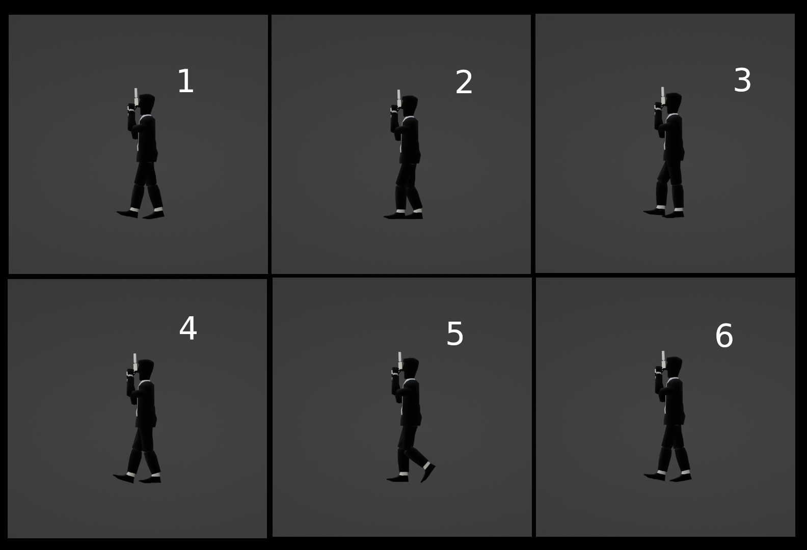

# Walk Animation Cycle
To be honest i find walk animation cycles being complex than run animation cycles.
Major steps of a walk animation cycle are almost like run animation cycles which include : 

	1 , 4 , 6	: Ground Contact - Here the Character foot touches the ground slightly . the opposite foot is behind the character.
	2 , 5  		: Character Down - Here the character's foot steps down completely , character body goes down as the other opposite foot prepares to go forward.
	3 			: Character Up - Here , the opposite foot rises above the ground also the body of the character rises up but does not touch the ground.
	1 , 4 , 6	: Ground Contact - The Foot that rose above the ground touches the ground slightly while the opposite foot remains behind.
